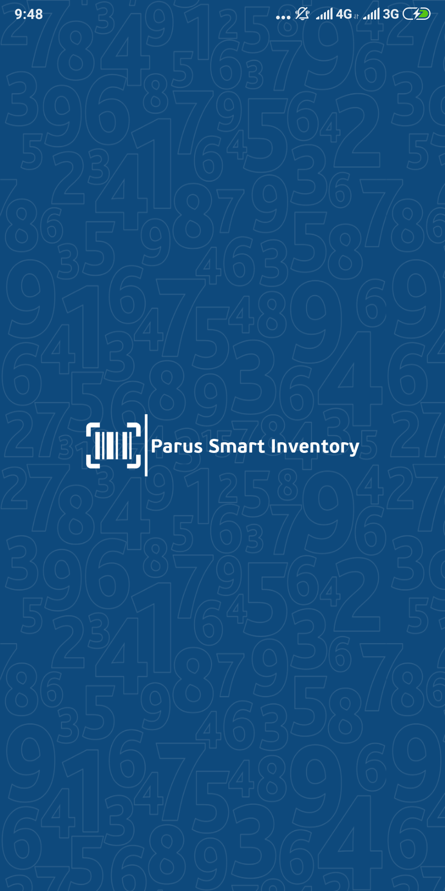
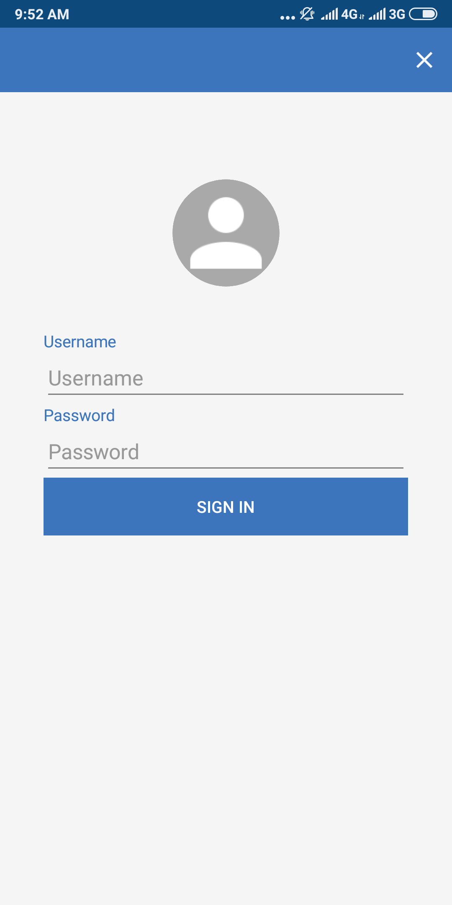
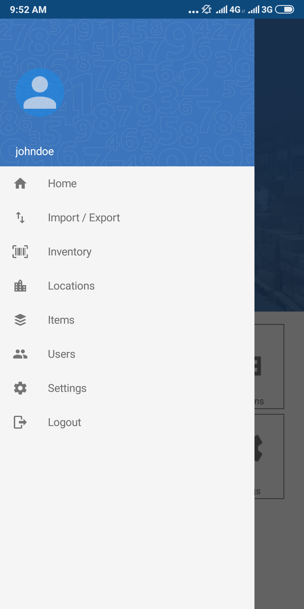
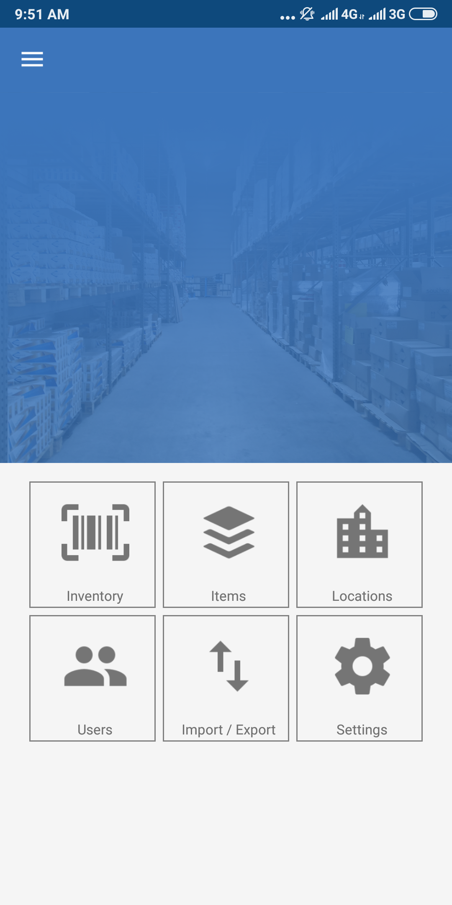
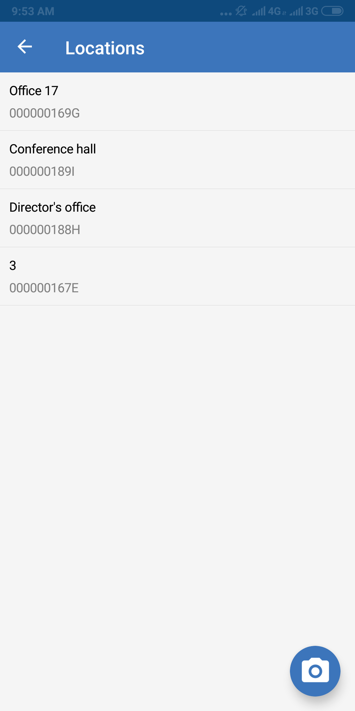
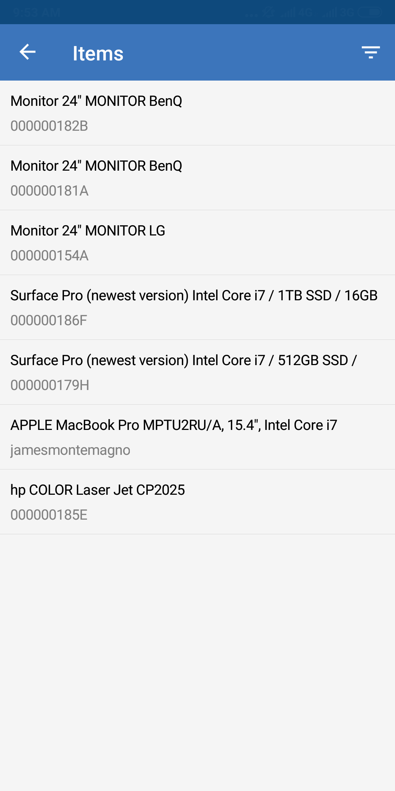
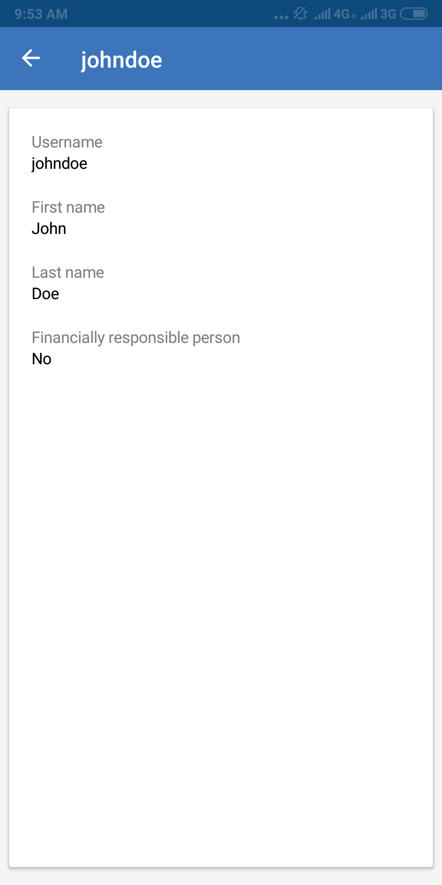
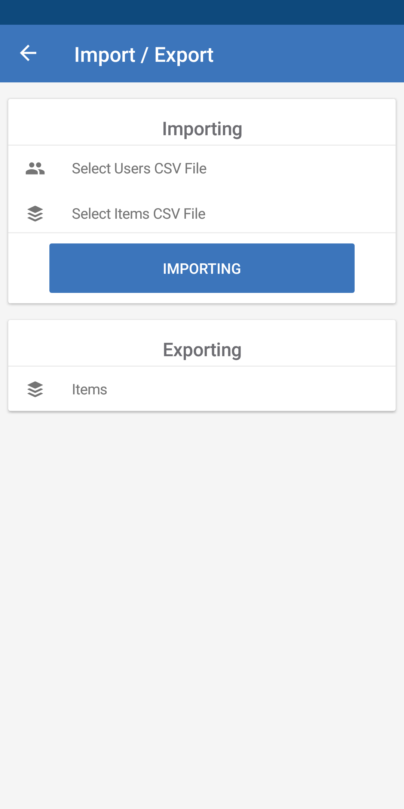

# Parus Electronic Inventory for Oracle

Электронная инвентаризация для Парус 8.

## Описание

В данном репозитории содержатся вспомогательные объекты Парус-Бюджет 8 для проведения электронной инвентаризации.

### Расширения для Парус-Бюджет 8
* [Массовое формирование штрих-кода](docs/beldicplace-gen-barcode.md)
* [Экспорт местонахождений инвентарных объектов](docs/beldicplace-csvexp.md)
* [Экспорт инвентаризирующих лиц](docs/belinvpersons-csvexp.md)
* [Экспорт инвентарных объектов](docs/belinventory-csvexp.md)
* [Импорт результатов инвентаризации](docs/belinventory-csvimp.md)

Так же для корректной работы требуется предварительная установка пакета [lob2table](addons/lob2table.sql).

## Мобильное приложение

|Платформа|Статус|Релиз|
|---|---|---|
|Android||[Android App](https://install.appcenter.ms/orgs/parusnik-belgorod/apps/parus-smart-inventory/distribution_groups/public)|

Мобильное приложение позволяет производить инвентаризацию объектов выгруженных из Парус-Бюджет 8, а так же сформировать файл экспорта результатов инвентаризации с последующим импортом в Парус.

        